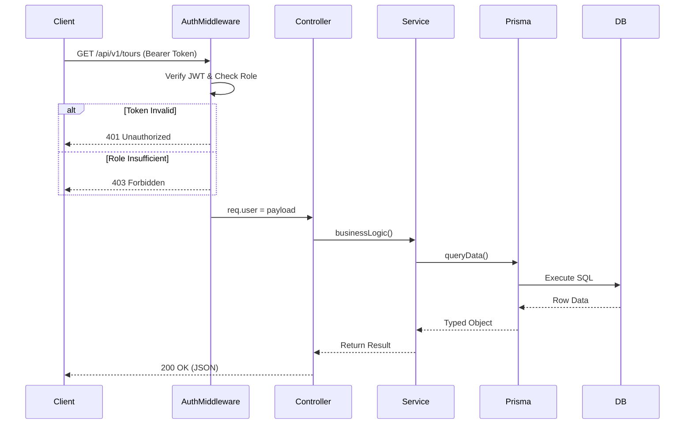

# ⚙️ LocalGems Backend - Elite Engine

<div align="center">


[](https://localgem-l-backend-3.onrender.com)
[](https://www.typescriptlang.org/)
[](https://www.postgresql.org/)
[](https://www.prisma.io/)

**A high-performance, security-hardened RESTful API powering the LocalGems ecosystem.**

[API Base](https://localgem-l-backend-3.onrender.com/api/v1) • [Endpoints](#-complete-api-reference) • [Tech Stack](#-tech-stack) • [Quick Start](#-quick-start) • [Architecture](#-technical-architecture)

</div>

---

## 📖 **Overview**

LocalGems Backend is a **production-ready engine** built with Node.js, Express, and Prisma. It implements strict type-safety, modular architecture, and advanced security practices to ensure a reliable foundation for global tour bookings.

### **🌟 Highlights**

- 🛡️ **Security Hardened** with Helmet, Rate-Limit, and CORS protection.
- 🔐 **Robust Auth** with JWT, Bcrypt, and strict custom payload validation.
- 🐘 **PostgreSQL & Prisma** for high-integrity, type-safe data management.
- 🧩 **Modular hexagonal design** for maximum scalability and maintainability.
- 🛰️ **Real-time Engine** with Socket.io for instant traveler-guide communication.
- 💳 **Stripe Integration** for robust, enterprise-grade payment processing.

---

## 🏗️ **Technical Architecture**

### **🔐 Request Lifecycle (Auth & RBAC)**


---

## 📍 **Complete API Reference**

### **🔐 Authentication**
- `POST /auth/register` - Create new traveler or guide account
- `POST /auth/login` - Authenticate and receive JWT tokens
- `POST /auth/refresh-token` - Renew session with refresh token

### **🗺️ Tour Discovery**
- `GET /tours` - List all tours with advanced filtering/sorting
- `GET /tours/:id` - Detailed tour information & itineraries
- `POST /tours` - Create new listing (**Guide/Admin**)
- `PATCH /tours/:id` - Update tour details (**Guide Owned**)

### **💼 Booking Lifecycle**
- `POST /bookings` - Create reservation with Stripe token
- `GET /bookings/my-bookings` - Fetch user-specific ride history
- `PATCH /bookings/:id` - Moderate booking status (**Guide/Admin**)

---

## 📁 **Project Structure (Detailed)**

```bash
backend/
├── src/
│   ├── app/
│   │   ├── modules/           # Feature Modules (Hexagonal Structure)
│   │   │   ├── auth/          # Authentication & Security logic
│   │   │   ├── tour/          # Discovery & Management
│   │   │   ├── booking/       # Reservation engine
│   │   │   └── user/          # Profile & RBAC
│   │   ├── middlewares/       # Security & Validation Guards
│   │   │   ├── auth.ts        # JWT & Role validation
│   │   │   └── validateReq.ts # Zod Schema validation
│   │   ├── routes/            # API Route Aggregator
│   │   └── utils/             # Business logic helpers
│   ├── prisma/                # Database Layer
│   │   ├── schema.prisma      # DB Schema (Source of Truth)
│   │   └── seed.ts            # High-fidelity demo data
│   ├── app.ts                 # Express configuration
│   └── server.ts              # Entry point & WebSocket init
├── .env.example               # Environment template
└── render.yaml                # Infrastructure configuration
```

---

## 🛠️ **Tech Stack**

<table>
<tr>
<td>

**Core**
- 🟢 Node.js 20+
- 🚂 Express.js v5
- 📘 TypeScript 5.8

</td>
<td>

**Database**
- 🐘 PostgreSQL
- 💎 Prisma ORM
- 💾 Prisma Studio (GUI)

</td>
<td>

**Security**
- 🔐 JWT / bcrypt
- 🛡️ Helmet.js
- 🛑 Rate Limiting

</td>
</tr>
</table>

---

## 🚀 **Quick Start**

```bash
# 1. Install dependencies
npm install

# 2. Setup Environment
cp .env.example .env

# 3. Initialize Database
npx prisma generate
npx prisma db push
npm run seed

# 4. Start Development
npm run dev
```

---

<div align="center">

**Built with ❤️ and Modern Tech by rakib Team**

</div>