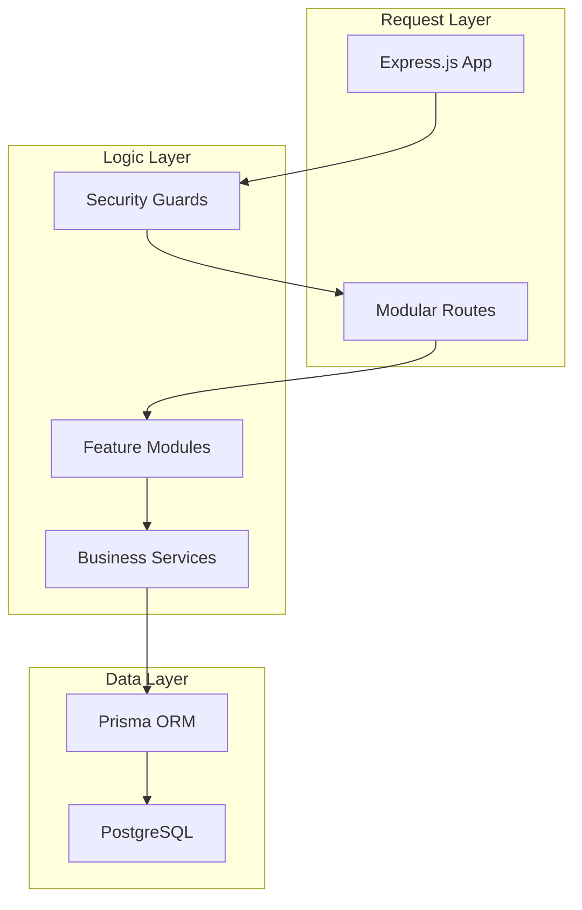

# ⚙️ LocalGems Backend - Elite Engine

<div align="center">


[](https://localgem-l-backend-3.onrender.com)
[](https://www.typescriptlang.org/)
[](https://www.postgresql.org/)
[](https://www.prisma.io/)

**A high-performance, security-hardened RESTful API powering the LocalGems ecosystem.**

[API Base](https://localgem-l-backend-3.onrender.com/api/v1) • [Endpoints](#8-api-documentation) • [Stack](#4-technology-stack) • [Setup](#5-installation--setup) • [Architecture](#3-architecture)

</div>

---

## 1. Project Overview

LocalGems Backend is a **production-ready engine** built with Node.js, Express, and Prisma. It implements strict type-safety, modular architecture, and advanced security practices to ensure a reliable foundation for global tour bookings.

---

## 2. Features

- **RBAC Engine**: Dynamic Role-Based Access Control (Admin, Guide, Tourist).
- **Listing Engine**: Robust tour discovery and inventory management.
- **Booking Engine**: Secure reservation lifecycle with validation logic.
- **Payment Engine**: Native Stripe integration for frictionless transactions.
- **Messaging Engine**: Real-time event broadcasting via Socket.io.

---

## 3. Architecture

### **Complete Backend Stack**


---

## 4. Technology Stack

- **Runtime**: Node.js 20+
- **Framework**: Express.js v5 (Edge)
- **Language**: TypeScript 5.8
- **ORM**: Prisma (PostgreSQL Client)
- **Database**: PostgreSQL (Relational)
- **Security**: JWT, Bcrypt, Helmet, CORS, Rate-Limit

---

## 5. Installation & Setup

### **Prerequisites**
- Node.js 20+
- PostgreSQL Server
- Stripe API Keys

### **Setup**
```bash
# 1. Install
npm install

# 2. Database
# Update .env with DATABASE_URL
npx prisma generate
npx prisma db push
npm run seed     # Essential for initial roles & users

# 3. Start
npm run dev
```

---

## 6. Project Structure

```bash
src/
├── app/
│   ├── modules/      # Domain Logic (auth, tour, booking, user)
│   ├── middlewares/  # Authentication & Global Error Handling
│   └── routes/       # Gateway Index
├── prisma/           # Schema & Seeding
└── server.ts         # Application Entry
```

---

## 7. Authentication & Authorization

- **Encryption**: Bcrypt hashing for password security.
- **Tokens**: JWT access and refresh tokens for session management.
- **Access**: Strictly enforced Role-Based authorization guards.

---

## 8. API Documentation

- **Auth**: `/api/v1/auth/login` - Returns JWT.
- **Tours**: `/api/v1/tours` - Multi-filter search.
- **Bookings**: `/api/v1/bookings` - Private booking records.
- **Status**: `/api/v1/health` - System health check.

---

## 9. Usage Instructions

### **Manual Testing**
Use Postman or Insomnia with the provided credentials:
- **Admin**: `admin@localgems.com` / `123456`
- **Guide**: `guide@localgems.com` / `123456`

---

## 10. Deployment Guide

- **Platform**: Render.
- **Provisioning**: Connect PostgreSQL instance first.
- **Variables**: `JWT_SECRET`, `STRIPE_SECRET_KEY`, `DATABASE_URL`.

---

## 11. Development Guidelines

- **Modular Pattern**: Separate controllers, services, and interfaces.
- **Error Handling**: Use the global error middleware for consistent responses.
- **Validation**: Use Zod schemas for all request payloads.

---

## 12. Security Considerations

- **Password Hashing**: Bcrypt iterations set to 12 for high entropy.
- **SQLi Prevention**: Prisma ORM provides native escaping/parameterization.
- **DDoS Prevention**: Express-rate-limit configured for all routes.

---

## 13. Contribution Guidelines

1. Follow the [Root Contribution Guide](../README.md#13-contribution-guidelines).
2. Document all new API endpoints in the `README`.

---

## 14. License

Licensed under **MIT**.

---

## 15. Roadmap

- [ ] **Redis Caching**: Performance optimization for tour searches.
- [ ] **Multi-provider Payment**: Support for PayPal and local gateways.
- [ ] **API Documentation**: Interactive Swagger/OpenAPI documentation.

---

## 16. Support & Contact

- **Email**: backend-support@localgems.com
- **Issues**: [BE Track](https://github.com/rak9b/localgem_l_backend/issues)

---

<div align="center">

**Built with ❤️ and Modern Tech by rakib Team**

</div>